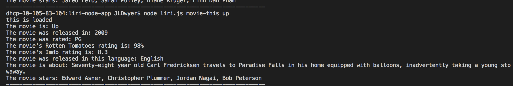

# liri-node-app

This is my liri-node application! 

This application looks at command line interface positions and runs functions dependent on key phrases for functions and different user inputs for validation, through the addition of information or lack thereof.

If a user wants to see results from the OMDB API on a movie title, they'll simply enter "node liri.js movie-this" without quotes and the name of the movie they'd like to know more about. Without any user input, the suggestion will be Jared Leto's unwatchable "Mr. Nobody". 

--
If a user wants to see results from the bandsintown API, they'll enter "node liri.js concert-this" without quotes and an accompanying musical artist to see when their next tour dates are. There is no fail-safe for this one, so have someone in mind!

--
The last API employed is Spotify's. Users will enter "node liri.js spotify-this-song" without quotes and accompanying song title. With the title, users will get back the title, the album, and the preview link of the song, along with the artist's name. Without a suggestion, the default pull from the random.txt file fills in, and searches 1991's "The Sign" by Ace of Base.

--

There's also a "node liri.js do-what-it-says" command, but I won't spoil the surprise.

Enjoy! See the rest of my work on my homepage at https://jldwyer25.github.io/PortfolioNew/.